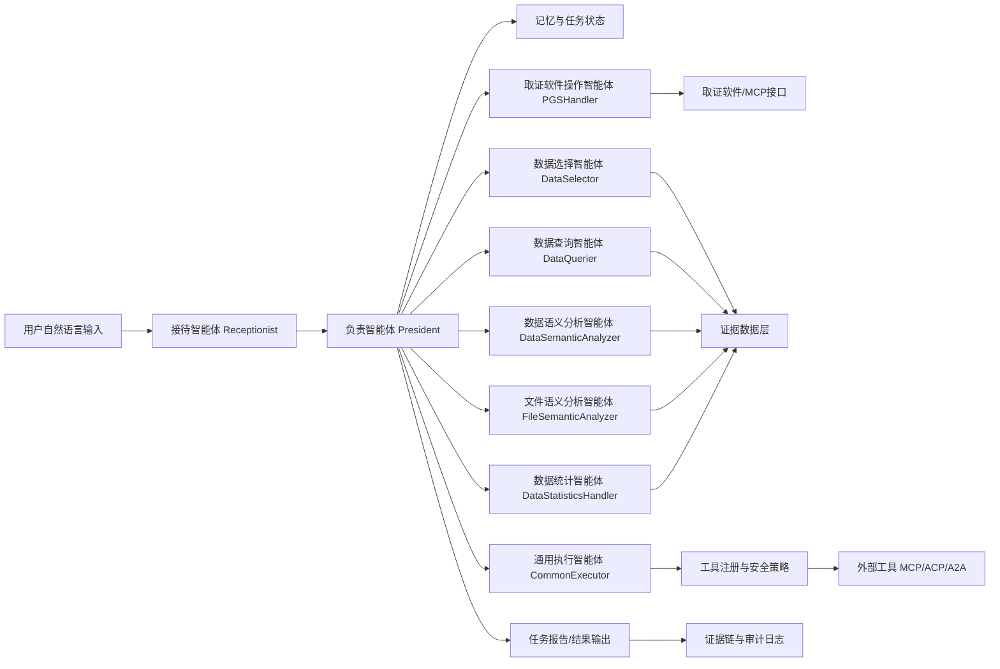

# 基于多智能体协同的取证分析 AI 工具技术路线

## 1. 目标定位

项目目标是研发一套面向电子数据取证场景的多智能体协同分析工具。系统以具备自主规划能力的主控智能体为核心，以取证软件、数据解析、语义分析、统计分析、可视化和报告导出工具为可调用能力，支持用户通过自然语言提出取证分析目标，由系统自动拆解任务、选择数据范围、调用工具、生成可追溯结论和报告草稿。

项目说明和四张图片共同指向三项约束：现有产品仍偏“固定功能工具”和“数据对接+总结问答”，难以覆盖案件全流程；本项目应以具备自主规划能力的智能体为核心，把范围选择、数据查询、语义过滤、统计分析等能力组合成端到端流程；企业可提供取证软件并开放MCP接口，因此技术路线必须围绕“智能体规划+取证工具编排+证据链溯源”展开。

据此确认后的申报书技术路线为：

1. 构建“接待智能体+主控规划智能体+核心子智能体+MCP工具层+证据数据层”的本地架构。
2. 以任务规划为主线，按“意图理解-任务拆解-范围选择-工具调用-结果复核-报告生成”闭环执行。
3. 核心能力先覆盖数据选择、查询、语义/文件分析、统计可视化、取证操作和多轮记忆，增强能力按阶段接入。
4. RAG仅作为知识增强与证据检索辅助，结合混合检索、可检查代码、人工确认、审计日志和工作空间沙箱保障可靠性。

该路线合理：PPT第一页已经给出智能体角色和工具储备骨架，项目说明明确要求降低表单式配置门槛并支持全数据类型，MCP接口能支撑取证工具接入；同时，单纯RAG无法解决取证流程编排和证据客观性问题，因此必须把RAG限定为辅助组件，而把自主规划、多轮记忆、工具白名单、沙箱执行、证据映射、反向范围选择和人工确认作为主干能力。

## 2. 调研结论

外部调研显示，当前可行路线不是单纯做聊天问答或普通RAG，而是采用“规划式智能体+标准化工具调用+证据链约束”的工程路线。

- ReAct 研究提出让大模型交替生成推理轨迹和行动，有利于跟踪、更新行动计划并调用外部工具，适合主控智能体的“计划-执行-观察-重规划”循环：https://arxiv.org/abs/2210.03629
- 大模型自主智能体综述将智能体能力归纳为规划、记忆、工具使用和评价等模块，与项目PPT中给出的智能体框架一致：https://arxiv.org/abs/2308.11432
- RAG 能增强知识密集任务的外部知识访问和事实性，但单纯相似度检索难以覆盖取证流程编排，因此本项目应将RAG作为领域知识和证据检索组件，而非完整方案：https://arxiv.org/abs/2005.11401
- MCP 规范提供了让LLM应用连接外部数据源和工具的标准方式，适合作为取证软件、解析工具、统计工具的适配协议：https://modelcontextprotocol.io/specification/2025-06-18
- NIST SP 800-86 强调数字取证需要围绕数据源、流程和报告形成规范化活动；NIST CFTT 强调取证工具可靠性、准确性和客观性测试，这要求系统结论必须可追溯、可复核：https://csrc.nist.gov/pubs/sp/800/86/final 与 https://www.nist.gov/itl/csd/secure-systems-and-applications/computer-forensics-tool-testing-program-cftt
- OWASP LLM Top 10 提醒LLM应用存在提示注入、不安全输出、插件设计缺陷和过度代理等风险，因此系统必须设置本地沙箱、权限确认、输出校验和审计日志：https://owasp.org/www-project-top-10-for-large-language-model-applications/

## 3. 总体架构



架构分为五层：

| 层级 | 作用 |
| ---- | ---- |
| 交互层 | 提供自然语言输入、任务计划展示、工具调用确认、结果浏览和证据跳转入口。 |
| 智能体编排层 | 由负责智能体统一规划，子智能体分别承担范围选择、查询、语义分析、统计分析、文件分析、工具执行和报告生成。 |
| 工具适配层 | 通过MCP或企业开放接口封装取证软件、解析器、检索引擎、代码执行、可视化和报告导出能力。 |
| 证据数据层 | 保存原始检材哈希、解析结果、全文索引、向量索引、结构化表、附件、分析产物和工具日志。 |
| 安全与审计层 | 控制工作空间沙箱、工具白名单、人工确认、敏感数据保护、提示注入防护、可复现日志和证据链溯源。 |

## 4. 核心智能体职责

为降低落地风险，第一版实现只保留主控闭环必需角色；图中其它角色作为增强能力逐步接入。

| 分层 | 智能体/模块 | 阶段定位 |
| ---- | ----------- | -------- |
| 核心必做 | Receptionist、President、DataSelector、DataQuerier、ToolRegistry、Reviewer、ReportGenerator | v0.1-v0.5打通“自然语言-计划-查询-证据溯源-报告草稿”闭环 |
| 阶段增强 | DataSemanticAnalyzer、FileSemanticAnalyzer、DataStatisticsHandler、MemoryManager | v0.5-v0.8增强语义研判、统计分析、多轮追问和反向范围选择 |
| 产品对接 | PGSHandler、MCP/取证软件适配器、CommonExecutor | 根据企业接口成熟度逐步接入导入、解析、导出和证据跳转 |

| 智能体 | 主要职责 | 输入 | 输出 |
| ------ | -------- | ---- | ---- |
| Receptionist | 理解用户问题，识别取证意图、对象、时间、范围和约束；必要时发起澄清。 | 用户自然语言、历史上下文 | 标准化UserIntent |
| President | 负责规划、执行调度、异常处理和最终复核；将任务拆成可执行DAG。 | UserIntent、工具能力、数据概况 | TaskPlan、执行决策、报告结论 |
| DataSelector | 根据用户目标和数据概况选择分析范围，支持从已发现线索反向定位检材、应用、人员、时间段。 | 任务目标、数据目录、元数据、历史发现 | DataScope |
| DataQuerier | 将问题转成SQL、全文检索、向量检索或工具查询。 | DataScope、查询条件 | CandidateRecords |
| DataSemanticAnalyzer | 对文本、聊天、日志等内容做语义过滤、实体/事件/关系提取。 | CandidateRecords、领域规则 | SemanticFindings |
| FileSemanticAnalyzer | 处理文档、图片、音视频附件的解析、OCR/ASR和语义摘要。 | 文件路径、附件元数据 | FileFindings |
| DataStatisticsHandler | 通过可检查代码完成筛选、聚合、统计和图表绘制。 | 结构化数据、分析目标 | 表格、图表、统计结论 |
| PGSHandler | 调用取证软件执行检材导入、解析、数据导出、报告导出和证据跳转。 | 工具调用请求 | ToolResult |
| CommonExecutor | 执行通用工具调用、格式转换和低风险自动化任务。 | 工具规格、参数 | 标准化结果 |
| Reviewer | 可作为President的内部阶段或独立智能体，对结论进行证据支撑、风险和格式复核。 | 中间结论、证据映射 | 审核意见、修正建议 |
| MemoryManager | 保存多轮对话、任务计划、历史结果和用户修正，用于追加任务、对比分析和回溯执行。 | 对话、TaskPlan、Finding、用户反馈 | MemorySnapshot |

## 5. 核心数据对象

后续开发时建议先定义统一数据模型，避免各智能体之间传递非结构化文本。

```text
CaseWorkspace
  case_id, case_name, evidence_root, workspace_root, policy, created_at

EvidenceItem
  evidence_id, source_path, source_type, hash_sha256, acquisition_method,
  imported_at, chain_of_custody, original_readonly_path

ParsedRecord
  record_id, evidence_id, source_ref, record_type, timestamp, actors,
  content, attachment_ids, metadata, parser_version

UserIntent
  intent_type, entities, time_range, data_scope_hint, question,
  expected_output, risk_level

TaskPlan
  task_id, goal, steps, dependencies, required_tools, approval_points,
  status, created_at, updated_at

ToolCallLog
  call_id, task_id, step_id, tool_name, input_hash, output_ref,
  status, started_at, ended_at, error_message

Finding
  finding_id, claim, confidence, supporting_record_ids,
  supporting_tool_call_ids, reviewer, report_section

MemorySnapshot
  memory_id, task_id, conversation_refs, accepted_findings,
  rejected_findings, user_corrections, reusable_scope
```

关键约束：任何报告结论都必须能反查到`EvidenceItem`、`ParsedRecord`和`ToolCallLog`，否则只能作为“分析线索”，不能作为确定性结论输出。

另外，`DataScope`必须保留范围来源：用户显式指定、系统自动选择、历史结果追加、反向范围选择或人工修正。这样后续报告才能解释“为什么分析这些数据”，也便于复核误选范围。

## 6. 关键技术路线

### 6.1 检材导入与工作空间

1. 创建案件工作空间，隔离原始检材、解析产物、索引、分析结果和报告。
2. 对导入检材计算SHA-256等哈希，记录来源、导入时间、操作者和取证软件任务ID。
3. 原始数据只读保存，所有解析和分析均在工作副本或派生数据上进行。
4. 通过企业开放MCP接口或产品SDK调用取证软件，优先实现检材导入、解析任务创建、数据导出和报告导出。

### 6.2 数据统一接入

数据进入系统后统一归一到两类存储：

- 结构化存储：聊天记录、联系人、时间线、文件元数据、日志、应用数据等进入SQLite/DuckDB或PostgreSQL。
- 检索存储：文本内容进入全文索引，长文档和语义片段进入向量索引，附件保留文件引用和解析结果。

MVP阶段建议先使用SQLite/DuckDB + SQLite FTS5，降低部署复杂度；数据量增大后再替换为PostgreSQL/OpenSearch/专用向量库。

### 6.3 意图理解与任务规划

Receptionist将用户输入转换为`UserIntent`，至少识别以下要素：

- 任务类型：检索、统计、关系分析、时间线分析、文件内容分析、报告生成、结果追问。
- 数据范围：检材、应用、聊天群、联系人、时间段、文件类型、关键词。
- 输出形式：证据列表、统计表、图表、线索摘要、报告段落。
- 风险等级：只读查询、批量分析、导出、涉及敏感数据、需要外部模型。

President基于`UserIntent`生成`TaskPlan`，每个步骤包含工具、输入、预期输出、失败重试策略和是否需要人工确认。执行采用“计划-工具调用-观察-重规划”循环：工具返回为空、数据范围过大、权限不足或结果相互矛盾时，自动调整查询范围或请求用户确认。

建议把任务计划拆成四类节点：

| 节点类型 | 示例 | 是否可自动执行 |
| -------- | ---- | -------------- |
| 只读查询节点 | 列出数据集、读取schema、关键词检索 | 默认自动执行 |
| 分析计算节点 | 语义过滤、统计聚合、绘图 | 低风险自动执行，代码执行需沙箱 |
| 取证操作节点 | 导入检材、解析检材、导出数据、导出报告 | 需记录审计日志，导出类建议确认 |
| 高风险节点 | 外部模型调用、批量导出、覆盖已有结果 | 必须人工确认 |

多轮任务通过MemoryManager实现：用户可以基于历史结果继续追问，例如“只看刚才发现的两个联系人”“把时间范围扩大到5月”“生成报告”。系统不重新从零规划，而是复用`MemorySnapshot`中的已确认范围、证据ID和中间结果。

### 6.4 工具调用与MCP适配

工具层统一封装为如下形式：

```text
ToolSpec
  name
  description
  input_schema
  output_schema
  permission_level
  side_effect
  timeout
  evidence_trace_required
```

第一批工具建议包括：

| 工具类别 | MVP工具 |
| -------- | ------- |
| 取证工具 | import_evidence、parse_evidence、export_records、export_report、jump_to_evidence |
| 数据工具 | list_datasets、describe_schema、read_records、extract_file_text、ocr_image |
| 检索工具 | keyword_search、sql_query、vector_search、hybrid_search |
| 分析工具 | semantic_filter、entity_extract、event_extract、run_stat_code、draw_chart |
| 报告工具 | build_finding_table、generate_report_draft、attach_evidence_refs |
| 安全工具 | request_approval、validate_tool_args、redact_sensitive_output、write_audit_log |

原则是智能体不直接访问文件系统和数据库，必须通过工具注册中心调用，工具注册中心负责参数校验、权限判断、日志记录和结果标准化。

工具返回结果必须包含三类信息：业务结果、证据引用、执行元数据。业务结果用于下一步分析；证据引用用于报告溯源；执行元数据记录工具名、版本、参数摘要、耗时、错误和输出位置。对于取证软件接口，应优先适配企业开放的MCP能力；在接口不可用时，用Mock工具保持智能体编排逻辑可测试。

### 6.5 语义分析与检索策略

项目不应只依赖普通RAG。推荐使用混合检索：

1. 精确过滤优先：先按案件、检材、时间、联系人、文件类型等结构化条件缩小范围。
2. 关键词与全文检索：对聊天、文档和日志做可解释命中。
3. 向量检索补充：处理模糊描述、同义表达、隐晦语义。
4. 语义复核：由DataSemanticAnalyzer对候选结果做实体、事件、关系和风险标签抽取。
5. 证据映射：每条语义结论都保留原始记录ID、片段位置、工具调用ID和置信度。
6. 反向范围选择：从高置信线索反查关联人员、群组、文件、时间段或检材，用于追加分析和证据跳转。

这条路线能解决项目说明中提到的“单纯RAG需要用户具备专家知识、模糊问题覆盖不足、研判准确性较低”的问题。

### 6.6 代码统计分析与可视化

统计分析采用“LLM生成分析计划和代码，系统负责约束执行”的方式：

1. DataStatisticsHandler读取数据schema和样例，生成统计方案。
2. 代码仅在本地沙箱执行，只允许读工作空间内的派生数据。
3. 执行前做静态检查，禁止网络访问、系统命令、删除写入原始证据等高风险操作。
4. 结果输出为表格、图表和统计解释，并绑定数据来源。
5. 常见统计模板沉淀为固定工具，减少每次生成代码带来的不稳定性。

优先实现的统计能力：

- 按时间、人员、群组、文件类型的频次统计。
- 关键词命中趋势和异常峰值分析。
- 联系人/账号/设备之间的关联关系图。
- 文档、图片、音频附件的类型分布与重点线索列表。

### 6.7 证据链与报告生成

报告生成不能只输出自然语言摘要，应输出结构化结论：

```text
结论：某时间段内A与B围绕目标事项高频沟通。
证据：record_id列表、原文片段位置、所属检材、工具调用日志。
分析过程：范围选择、查询条件、语义过滤规则、统计方法。
置信度：高/中/低及原因。
待人工确认项：需要人工复核的歧义片段或低置信度判断。
```

报告导出支持Markdown/HTML/PDF草稿，并在对接取证产品后调用产品报告导出能力。所有结论需支持跳转至取证任务、取证数据或原始片段。

## 7. 安全边界与质量控制

| 风险 | 控制措施 |
| ---- | -------- |
| 幻觉结论 | 结论必须绑定证据ID；无证据支撑时标记为线索；Reviewer复核。 |
| 提示注入 | 将用户数据、系统指令、工具描述隔离；检材文本不得覆盖系统策略；工具参数做schema校验。 |
| 过度代理 | 高风险工具调用需人工确认；导出、批量处理、外部模型调用默认需授权。 |
| 数据泄露 | 默认本地运行；外部模型调用需显式授权和脱敏；工作空间沙箱限制访问范围。 |
| 取证客观性不足 | 原始检材只读，记录哈希、工具版本、调用参数、输出文件和操作者。 |
| 代码执行风险 | 统计代码在沙箱运行，禁止网络、系统命令和原始证据写操作。 |

## 8. MVP开发顺序

第一阶段：框架和Mock闭环，对应2026.6.1 -- 2026.9.1。

1. 建立案件工作空间和数据模型。
2. 实现工具注册中心和MCP/Mock工具适配。
3. 实现Receptionist和President，支持用户问题转`TaskPlan`。
4. 定义任务状态机、人工确认规则、审计日志和工作空间沙箱。
5. 使用2个样例场景验证：聊天关键词统计、文档内容线索提取。

第二阶段：取证工具和数据闭环，对应2026.9.1 -- 2026.12.1。

1. 对接企业取证软件的导入、解析、导出能力。
2. 建设结构化表、全文索引、附件解析和基础语义索引。
3. 增加DataSelector、DataQuerier、DataSemanticAnalyzer。
4. 实现结构化过滤、全文检索、语义检索和证据ID绑定。

第三阶段：端到端智能体增强，对应2026.12.1 -- 2027.3.1。

1. 增加FileSemanticAnalyzer、DataStatisticsHandler、Reviewer。
2. 增加MemoryManager，支持多轮任务修正和基于历史结果追加任务。
3. 实现反向范围选择、图表生成、证据跳转和报告草稿。
4. 增加真实或仿真案件数据评测集，形成可演示的端到端案例。

第四阶段：安全加固和交付，对应2027.3.1 -- 2027.6.1。

1. 做安全加固、日志完善、性能优化和异常处理。
2. 固化报告模板、演示脚本、测试用例和验收数据。
3. 完成用户手册、测试报告、技术总结和知识产权材料。

## 9. 评测方法

项目评测需要同时覆盖功能、效果和取证客观性。

| 评测项 | 评测方法 | 建议指标 |
| ------ | -------- | -------- |
| 意图识别 | 使用典型取证问题集测试任务类型、范围、输出要求识别 | 意图识别准确率不低于80% |
| 任务规划 | 检查`TaskPlan`是否包含必要步骤、工具和确认点 | 规划可执行率不低于70% |
| 数据检索 | 对已标注线索测试结构化过滤、全文检索和语义检索 | 关键线索召回率不低于75% |
| 语义研判 | 对候选记录做实体、事件、关系抽取人工复核 | 关键线索准确率不低于75% |
| 证据溯源 | 抽查报告结论是否能回溯到证据、记录和工具日志 | 结论溯源覆盖率达到100% |
| 自动化效率 | 对比传统人工配置步骤和原型自动步骤 | 最终人工干预减少75%以上 |
| 处理速度 | 对同一数据挖掘分析场景做耗时对比 | 最终处理速度提升50%以上 |

## 10. 推荐工程骨架

当前已启动的v0.1代码采用轻量Python包结构，先验证核心闭环；后续接入真实MCP/取证软件时，再扩展为下列完整工程结构。

已实现的最小代码框架：

```text
forensic_agent/
  __main__.py          # 命令行演示入口
  agents.py           # Receptionist、President、Reviewer
  audit.py            # 审计日志
  dataset.py          # Mock检材和解析记录
  models.py           # EvidenceItem、ParsedRecord、TaskPlan、Finding等数据对象
  orchestrator.py     # 任务执行闭环
  tools.py            # Mock工具注册中心和检索/分析/报告工具
tests/
  test_demo.py        # 最小闭环测试
```

目标完整工程骨架：

```text
forensic-agent/
  app/
    main.py
    config/
    agents/
      receptionist.py
      president.py
      data_selector.py
      data_querier.py
      semantic_analyzer.py
      file_analyzer.py
      statistics_handler.py
      reviewer.py
    orchestration/
      planner.py
      executor.py
      memory.py
      state.py
      approvals.py
    tools/
      registry.py
      schemas.py
      forensic_mcp.py
      search_tools.py
      analysis_tools.py
      report_tools.py
      safety_tools.py
    data/
      models.py
      workspace.py
      evidence_store.py
      indexes.py
      scope.py
    security/
      sandbox.py
      approvals.py
      audit.py
      redaction.py
    reports/
      templates/
      generator.py
  tests/
    fixtures/
    test_planning.py
    test_tools.py
    test_memory.py
    test_traceability.py
  docs/
    api.md
    evaluation.md
```

## 11. 验收指标映射

| 申报指标 | 技术实现路径 |
| -------- | ------------ |
| 减少75%人工干预环节 | 通过自然语言意图识别、任务DAG规划、工具自动编排、报告自动生成实现。 |
| 案件处理速度提升50% | 通过统一索引、自动范围选择、批量统计代码和可视化模板实现。 |
| 支持结构化/非结构化数据 | 通过关系表、全文索引、向量索引、文件解析和附件语义分析实现。 |
| 至少基础取证自动化 | 对接导入、解析、数据导出、报告导出等取证工具能力。 |
| 至少基础统计分析 | 基于DuckDB/Pandas等本地执行引擎完成筛选、聚合、统计和图表。 |
| 至少一个落地案例 | 以真实或仿真案件数据跑通端到端流程并输出可追溯报告。 |
| 支持多轮任务修正 | 通过MemoryManager保存历史任务、结果、用户修正和可复用数据范围实现。 |
| 支持取证客观性溯源 | 通过EvidenceItem、ParsedRecord、ToolCallLog、Finding四类对象绑定实现。 |

## 12. 近期可落地的第一个演示场景

已优先启动“聊天与文档混合数据线索分析”作为v0.1演示场景：

1. 用户输入：“分析检材中2026年3月至5月与资金往来相关的聊天和文档，找出重点联系人、关键词趋势和可疑文件。”
2. Receptionist抽取时间范围、主题、数据类型和输出要求。
3. President生成计划：选择数据范围、查询聊天和文档、语义过滤资金相关内容、统计联系人和关键词、生成图表、输出报告草稿。
4. DataQuerier执行SQL/全文检索，DataSemanticAnalyzer做语义判断，DataStatisticsHandler生成统计图表。
5. DataSelector根据高置信线索反向扩大或收缩范围，例如定位重点联系人相关群组、文件和时间段。
6. Reviewer检查每条结论是否有原始记录和工具日志支撑。
7. Report工具生成带证据ID和跳转链接的报告草稿。

该场景覆盖自然语言交互、自主规划、数据查询、语义过滤、统计分析、可视化、证据链溯源和报告导出，适合作为项目早期验收样例。

当前代码运行方式：

```bash
python -m forensic_agent
python -m unittest discover -s tests -v
```
