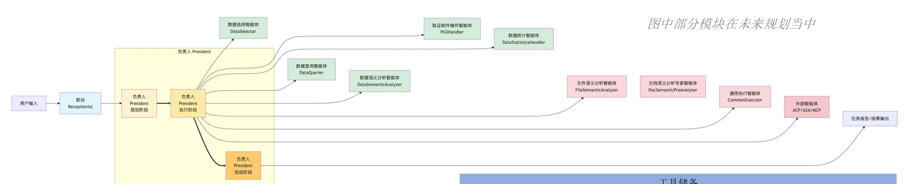

# 申报书补充内容

## 二、研究目标和内容

### 1. 课题拟解决的关键技术问题，拟采取的技术路线和主要创新点

**1. 拟解决的关键技术问题**
（1）意图难转任务：取证术语、模糊提问和跨阶段调查需求难自动转为可审计步骤。
（2）多源数据难统一：结构化、非结构化、附件和文件内容割裂，单纯RAG难支撑准确范围选择、语义研判和关联分析。
（3）工具链难协同且难溯源：导入、解析、查询、统计、导出缺少统一编排，权限边界、结果复核和证据追踪不足。

**2. 拟采取的技术路线**
（1）构建“接待智能体+主控规划智能体+核心子智能体+MCP工具层+证据数据层”的本地架构。
（2）以任务规划为主线，按“意图理解-任务拆解-范围选择-工具调用-结果复核-报告生成”闭环执行，协同查询、语义/文件分析、统计可视化、取证操作和多轮记忆。
（3）RAG仅作知识增强与证据检索辅助，结合混合检索、可检查代码、人工确认、审计日志和沙箱保障可靠性。

**3. 主要创新点**
（1）工程创新：自主规划式多智能体编排取证全流程，突破固定功能和表单式操作。
（2）方法创新：以反向范围选择、证据映射和多源关联支撑线索发现、证据链溯源和自动化报告。
（3）可信创新：用规则约束、工具白名单、沙箱、人工确认和复核机制降低幻觉与误操作风险，兼顾可行性和客观性。

## 三、课题计划

### （二）项目实施进度及阶段主要目标

| 开始日期 -- 结束日期 | 主要工作内容 | 预期目标 | 绩效指标 |
| -------------------- | ------------ | -------- | -------- |
| 2026.6.1 -- 2026.9.1 | 聚焦“能否正确规划任务、能否形成可追踪日志”的最小闭环；梳理电子数据取证场景、用户问题类型和证据溯源要求；设计总体架构、核心/增强智能体边界、任务状态机、工具注册规范、数据对象、工作空间沙箱和人工确认规则；完成Mock工具适配；固定“聊天与文档线索分析”最小演示场景。 | 完成需求分析、总体技术方案和MVP设计，形成可运行的多智能体框架雏形，能够接收自然语言需求并输出结构化任务计划、工具调用序列和审计日志。 | 形成需求、架构、数据模型文档各1份；沉淀不少于30类取证意图/任务模板；完成不少于10个候选工具能力登记和不少于4个Mock工具；原型v0.1支持意图识别、任务拆解、计划展示、日志记录和人工确认；任务规划可执行率达到60%以上；完成“聊天与文档线索分析”演示。 |
| 2026.9.1 -- 2026.12.1 | 先打通取证软件接口、数据统一接入和证据ID绑定，再建设检索增强能力；开发MCP/工具适配层，对接检材导入、解析、数据导出和报告导出；建设结构化数据表、全文索引和附件解析流程；实现数据选择、数据查询、语义过滤、基础知识增强和混合检索；完善工具参数校验、权限控制、异常处理和结果回传机制。 | 完成基础取证能力自动化编排和数据查询分析闭环，系统能够从用户问题自动选择数据范围，调用取证/检索/分析工具并返回可追溯结果。 | 原型v0.5完成导入、解析、查询、导出等不少于4类取证工具适配；支持聊天记录、日志、文档、图片等不少于4类数据处理；完成结构化过滤、全文检索、语义检索3类检索方式；任务规划可执行率达到70%以上；完成不少于8个测试用例；人工配置环节较传统流程减少40%以上。 |
| 2026.12.1 -- 2027.3.1 | 完成端到端智能体增强；分开建设语义研判能力和统计分析能力，开发文件语义分析、统计可视化、记忆追踪和反向范围选择；支持基于历史对话和历史结果追加任务；实现证据来源、工具调用、语义结论、统计图表和报告段落之间的可追溯映射；开展真实或仿真案件数据验证。 | 形成端到端取证分析原型，支持“自然语言问题-范围选择-数据查询-语义研判-统计可视化-证据复核-报告草稿”的完整链路。 | 原型v0.8集成不少于6类智能体角色和8类工具能力；完成不少于2个案件数据分析案例；支持不少于2轮连续追问和任务修正；关键线索提取准确率达到75%以上；报告结论溯源覆盖率达到100%；人工干预环节减少60%以上，案件处理速度提升30%以上。 |
| 2027.3.1 -- 2027.6.1 | 开展系统集成、性能优化、安全加固和效果评测；完善本地沙箱、工具白名单、人工确认、审计日志、证据链溯源、提示注入防护和幻觉抑制机制；固化报告模板、演示脚本和测试用例；完成实际落地案例、演示材料、使用文档、结题报告及知识产权材料准备。 | 交付一套可演示、可复现实验结果的基于多智能体协同的取证分析AI工具原型，并形成完整验收材料和可复用技术文档。 | 原型v1.0支持结构化与非结构化数据统一接入、关联分析和报告导出；至少完成1个实际落地取证分析案例；人工干预环节减少75%以上，数据挖掘分析场景处理速度提升50%以上；输出用户手册、测试报告、技术总结各1份；形成软件著作权或专利申请材料不少于1项。 |

### （三）现有工作基础和工作条件
【直接相关的工作基础】
1）前期技术调研
课题组已围绕“基于多智能体协同的取证分析AI工具研发”开展了较系统的前期技术调研。一方面，梳理了当前国内外电子数据取证AI应用现状，认识到现有产品多停留在聊天问答、文档总结、群聊分析、代码辅助统计等单点能力，普遍存在固定功能化、流程割裂、缺少案件全流程业务逻辑和证据链溯源能力等不足。另一方面，重点调研了RAG、LightRAG、多智能体自主规划、工具调用、MCP接口、代码执行沙箱和大模型安全边界等技术，明确了单纯RAG更适合作为取证知识增强与证据检索辅助，难以单独承担取证流程编排、范围选择、结果复核和证据客观性保障任务。

在此基础上，课题组进一步结合企业宣讲材料和取证业务需求，形成了“接待智能体+主控规划智能体+核心子智能体+MCP工具层+证据数据层”的总体思路，明确以任务规划为主线，围绕“意图理解-任务拆解-范围选择-工具调用-结果复核-报告生成”构建闭环流程。同时，课题组已关注NIST数字取证流程、取证工具可靠性测试、LLM应用提示注入与过度代理风险等规范与安全问题，将本地化运行、工作空间沙箱、工具白名单、人工确认、审计日志和证据映射作为系统可信运行的基础要求。上述调研为本项目技术路线选择、阶段计划制定和原型系统实现奠定了直接基础。

参考图1：企业宣讲PPT中的多智能体取证分析框架图。

该图对本项目技术路线具有直接参考价值：其左侧给出了“用户输入-接待智能体-负责智能体”的任务入口和主控规划链路，中部给出了数据选择、数据查询、数据语义分析、取证软件操作、数据统计等可编排子能力，右侧体现了通用执行、外部智能体接口和结果输出；下方“智能体框架”和“工具储备”进一步明确了自主规划、记忆、工具调用、本地沙箱，以及取证工具、数据工具、分析工具、联动工具等能力边界。因此，本项目将该图作为总体架构设计的重要依据，但在实现顺序上进一步收敛为“核心必做能力优先、增强能力分阶段接入”，以降低落地风险。

前期调研参考资料如下：

| 方向 | 参考资料 | 对本项目的启发 |
| ---- | -------- | -------------- |
| 数字取证流程 | [NIST SP 800-86: Guide to Integrating Forensic Techniques into Incident Response](https://csrc.nist.gov/pubs/sp/800/86/final) | 数字取证需要围绕数据来源、分析过程和报告形成规范流程，本项目据此强调证据链溯源、审计日志和报告可复核。 |
| 取证工具可靠性 | [NIST Computer Forensics Tool Testing Program, CFTT](https://www.nist.gov/itl/csd/secure-systems-and-applications/computer-forensics-tool-testing-program-cftt) | 取证工具应关注可靠性、测试方法和客观性，本项目据此设置工具调用日志、证据ID绑定和阶段性测试用例。 |
| 多智能体推理与行动 | [ReAct: Synergizing Reasoning and Acting in Language Models](https://arxiv.org/abs/2210.03629) | ReAct体现“推理-行动-观察”的循环思想，可支撑主控智能体进行任务规划、工具调用和动态重规划。 |
| RAG知识增强 | [Retrieval-Augmented Generation for Knowledge-Intensive NLP Tasks](https://arxiv.org/abs/2005.11401) | RAG可增强外部知识访问和事实检索，但本项目将其定位为取证知识库与证据检索辅助，而非全流程主方案。 |
| 工具接入协议 | [Model Context Protocol Specification](https://modelcontextprotocol.io/specification/2025-06-18) | MCP为大模型应用连接外部数据源和工具提供标准化方式，适合作为取证软件、解析工具和统计工具的适配方向。 |
| 大模型应用安全 | [OWASP Top 10 for Large Language Model Applications](https://owasp.org/www-project-top-10-for-large-language-model-applications/) | LLM应用存在提示注入、不安全输出、过度代理等风险，本项目据此设计沙箱、工具白名单、人工确认和输出复核机制。 |

2）系统框架初步实现

【其他相关的工作基础】
1）	个人其他相关工作基础

2）团队成员其他相关工作基础
团队成员已具备较好的RAG与多智能体项目基础，可为本课题的知识检索、工具编排和评测验证提供支撑。在RAG方向，成员曾围绕“规则引导”的多模态有害内容检测开展系统实验，目标是在海量规则中检索与图片内容相关的违规规则并完成判断。该工作从端到端多模态大模型能力验证出发，逐步发现模型在大量规则事实核查中存在规则检索不准、幻觉较强、长文本处理效率低等问题，进而引入LightRAG开展技术选型、可行性验证、消融实验和效果分析。实验过程中，成员完成了规则库构建、知识库分层组织、三级/四级标签组织方式对比、json与txt数据组织效果对比、LightRAG检索模式与参数调试、返回references核查、top5/top10命中分析以及全量规则知识库实验，积累了检索增强、知识组织、实验评测和结果分析经验。

在工程实现方面，成员在上述RAG项目中使用SQLite组织实验数据，使用Redis部署多组RAG服务，结合并发请求、REST API调用、文件路径/本地图片读取、数据清洗和结果保存等方式优化实验效率，并对抽样方式、数据质量、规则层级、prompt设计和文件格式对检索效果的影响进行了反复验证。这些经验可直接服务于本项目的取证知识库构建、结构化与非结构化数据组织、混合检索、证据范围选择、结果复核和性能优化。

在多智能体方向，成员参与过端到端软件开发任务的大模型基准测试工作，相关项目基于人工采集的前端Web应用构建Benchmark，并通过Behave行为驱动测试框架验证由多智能体系统根据需求文档生成的Python测试代码。成员参与了数据集扩充、项目可用性检查、标注数据整理、annotation.json中feature与step脚本提取、测试脚本调试、浏览器初始化逻辑修正、异常退出问题处理、日志记录和不同多智能体代码生成框架复现与测评等工作。该经历与本项目中的自主规划智能体、任务拆解、工具调用编排、流程化验证、审计日志和阶段性评测具有较强关联，可为项目原型开发和测试验证提供直接支撑。

【工作条件】
1）实验室工作条件
项目依托四川省公安厅-四川大学“网络违法犯罪生态研究中心”，拥有高性能GPU计算平台，提供与项目相关的大模型搭建和应用的环境。另外还能提供取证仪器设备，如信号分析器、侧信道能量分析设备、PC示波器和混合信号示波器、故障注入定制PCB板、硬盘还原与破解工具、远程勘验工具集等。
